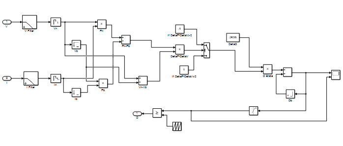
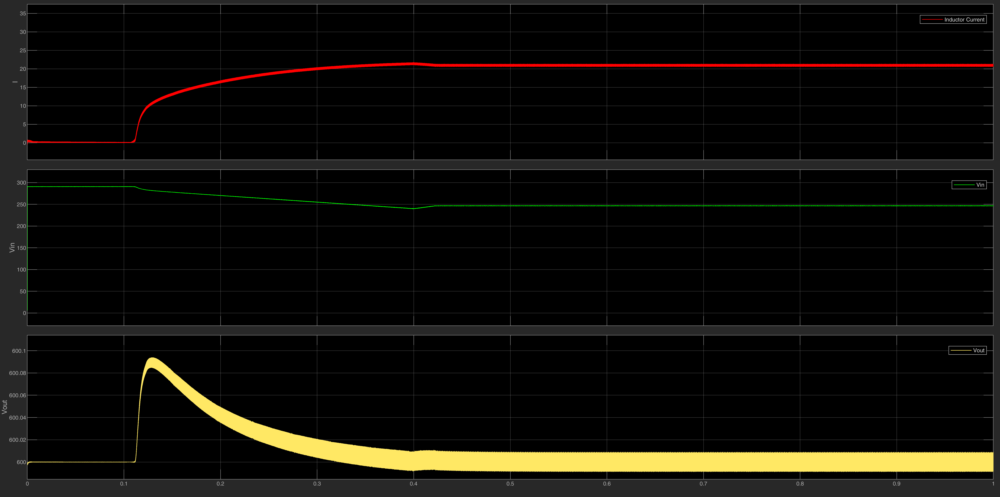

# ☀️ PV System Modeling & Advanced MPPT Implementation

This repository contains the simulation models for the Photovoltaic (PV) array characteristics and the implementation of Maximum Power Point Tracking (MPPT) algorithms, progressing from fundamental models to advanced global scanning techniques. This serves as the foundation for the Solar-Powered EV Charging Station project.

## 📂 Folder Structure

This folder contains four main MATLAB/Simulink files representing our design evolution:
1. **`pv_curves.slx`**: Mathematical modeling of the PV cell to generate the I-V and P-V characteristics.
2. **`MPPT_PO1.slx`**: The standalone logic block for the Perturb and Observe (P&O) MPPT algorithm.
3. **`Incremental_conductance.slx`**: The complete system integration testing the standard MPPT algorithm with the power stage under uniform conditions.
4. **`Central_Boost_MPPT_with_check.slx`**: The ultimate advanced implementation featuring a **Global Scanning MPPT (Forced Sweep)** algorithm designed to mitigate Partial Shading conditions.

---

## 1️⃣ PV Array Modeling (`pv_curves.slx`)
Before designing the control system, it was crucial to understand the non-linear characteristics of the PV panels used in our system. Instead of using built-in Simscape blocks, we built a parameterized mathematical model to accurately plot the P-V and I-V curves based on the manufacturer's datasheet.

*   **Inputs:** Solar Irradiance ($W/m^2$) and Temperature ($^\circ C$).
*   **Outputs:** PV Current ($I_{pv}$) and Power ($P_{pv}$) against Voltage ($V_{pv}$).
*   **Initialization:** Parameters such as $V_{oc}$, $I_{sc}$, $N_s$, and $I_{ref}$ are configured directly within the model blocks.

**System Overview:**

**P-V and I-V Characteristics:**
Below are the curves generated by the model, demonstrating the exact Maximum Power Point (MPP) under Standard Test Conditions (STC):

---

## 2️⃣ Standard MPPT Logic (`MPPT_PO1.slx`)
To extract the maximum available power under uniform irradiance, we implemented the **Perturb and Observe (P&O)** algorithm. The logic block continuously monitors the change in power ($\Delta P$) and voltage ($\Delta V$) to adjust the duty cycle of the DC-DC converter.

**Algorithm Implementation:**

---

## 3️⃣ Complete MPPT System Simulation (`Incremental_conductance.slx`)
This model represents our baseline integration of the PV array, the DC-DC Boost Converter, and the standard MPPT controller into a complete closed-loop system. 

**System Architecture:**
*   PV Array Model.
*   Boost Converter (Inductor, Diode, IGBT switch).
*   Battery (representing the DC load/bus).
*   MPPT Controller.

**Full System Model:**

**Tracking Performance:**
The scopes below illustrate the system successfully tracking and stabilizing at the maximum power point under steady-state conditions. The power curve (orange) reaches its peak value and stabilizes, while voltage (blue) and current (yellow) adapt accordingly to maintain the MPP.

---

## 4️⃣ Advanced Global MPPT for Partial Shading (`Central_Boost_MPPT_with_check.slx`)
Standard MPPT algorithms like P&O often fail under partial shading conditions, getting trapped at local power peaks instead of finding the true Global Maximum Power Point (GMPP). 

To solve this, we implemented a custom **Forced Voltage Sweep** algorithm within a MATLAB Function block. This represents the final and most robust stage of our PV control logic.
* The algorithm periodically forces the PV voltage to sweep from the open-circuit voltage ($V_{oc\_est}$) down to a minimum scan voltage ($V_{scan\_min}$).
* During this sweep, it logs the absolute maximum power encountered and returns the system precisely to that operating voltage ($V_{best}$).

**Full System Architecture (Closed-Loop):**
This model integrates the PV array, the DC-DC Boost Converter, and the advanced Global MPPT controller to ensure maximum energy yield regardless of environmental shadowing.

**Tracking Performance (Global Scan):**
The scopes below illustrate the forced sweep mechanism. The system scans the voltage range, identifies the global peak, and locks onto it, avoiding local maxima caused by partial shading.

---

### 🔧 How to Run
1. Open MATLAB and navigate to this folder.
2. Open any `.slx` file based on the design stage you wish to evaluate.
3. Click **Run** to execute the simulation and view the results in the Scope/XY Graph blocks.
