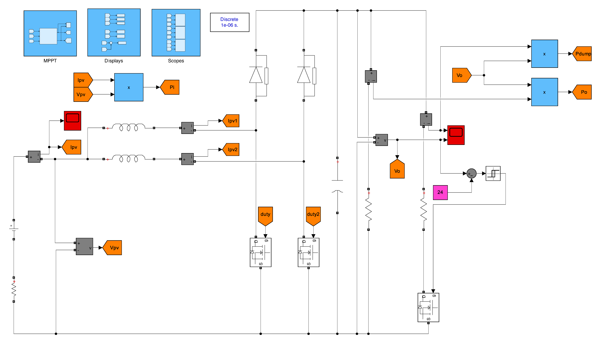
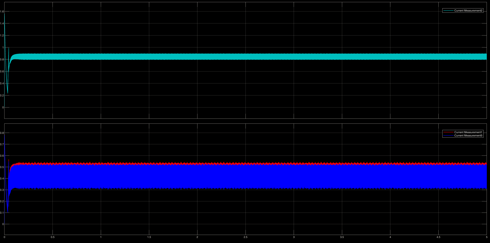
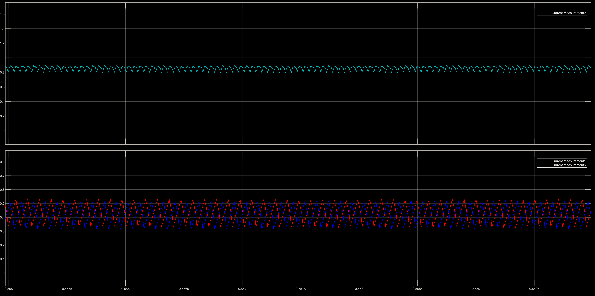
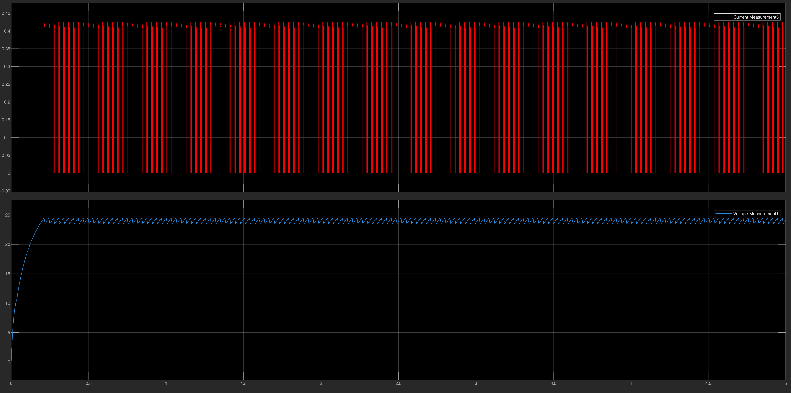

# ⚡ Interleaved Boost Converter & Thevenin Equivalent Testing

This repository contains the simulation models for the DC-DC Boost Converter stage, which links the PV array to the DC Link. The models document a strict engineering design evolution: starting from a basic open-loop single-phase boost, progressing through Thevenin equivalent testing for control loop tuning, and culminating in a fully controlled, two-phase Interleaved Boost Converter.

## 📂 Engineering Progression & File Structure

Our design methodology followed a sequential validation process:

### Phase 1: Open-Loop Concept Validation

* **`Boost_Source_Open_Loop.slx`**: The baseline model to verify the fundamental voltage step-up capability of a standard single-phase boost converter.
* **`Interleaved_Boost_Source_Open_Loop.slx`**: Introduction of the two-phase interleaved topology. Operated in open-loop to observe the natural cancellation of input current ripples before applying feedback control.

### Phase 2: Control Tuning via Thevenin Equivalent

* **`Boost_Thevenin_Equivalent.slx`**: To decouple the converter's control logic from the complex non-linearities of the PV array, we substituted the PV source with a Thevenin Equivalent circuit (Controlled Current Source + DC Voltage Source). This allowed for precise tuning of the closed-loop PI controllers on a single-phase boost.
* **`Interleaved_Boost_Thevenin_Equivalent.slx`**: Applying the tuned closed-loop control to the two-phase interleaved topology using the Thevenin equivalent source.

### Phase 3: Final System Integration

* **`Interleaved_Boost_Thevenin_Full_Control_ForDesign.slx`**: The final, comprehensive model. It features the complete Interleaved Boost Converter operating under full closed-loop control (Voltage and Current loops) with the 180° phase-shifted PWM generation.

---

## 🏗️ Final System Architecture

The Interleaved Boost Converter utilizes two parallel boost phases operating 180° out of phase. This topology was selected to significantly reduce the input current ripple, lessen the stress on the input capacitors, and improve overall converter efficiency.

**System Model (`Interleaved_Boost_Thevenin_Full_Control_ForDesign.slx`):**

---

## 📊 Performance Validation

### 1. Ripple Cancellation (The Interleaving Advantage)

The primary advantage of the interleaved topology is demonstrated below. The individual inductor currents ($I_{L1}$ and $I_{L2}$, shown in red and blue) exhibit high ripple. However, because they are driven 180° out of phase, their sum (the total input current, shown in cyan) is remarkably smooth, proving successful ripple cancellation.

**Current Ripple Scopes (Full View & Zoomed):**

### 2. Output Regulation (Closed-Loop Stability)

The closed-loop PI controllers maintain tight regulation of the output. The scopes below verify that the converter successfully steps up the voltage and maintains steady-state stability under the simulated load conditions.

**Output Voltage & Current Scopes (Full View & Zoomed):**

---

### 🔧 How to Run

1. Open MATLAB and navigate to this folder.
2. Open any `.slx` file based on the design phase you wish to review.
3. Click **Run** to execute the simulation. Open the designated Scope blocks to observe the switching dynamics and control stability.
