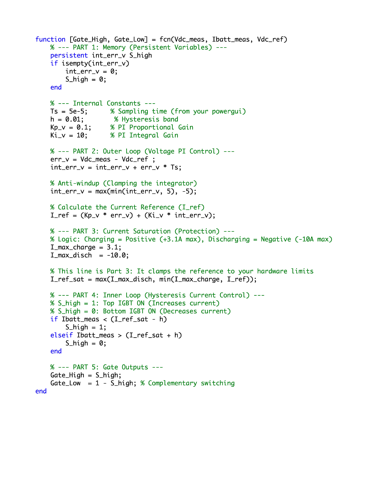

# 🔋 Battery Energy Storage System (BESS) & Two-Quadrant Chopper

This folder contains the simulation models for the Battery Energy Storage System (BESS) and its bidirectional DC-DC converter (Two-Quadrant Chopper). The models are structured to demonstrate the complete engineering design process, from low-power open-loop prototyping to full-scale closed-loop control under dynamic conditions.

## 📂 Engineering Progression & File Structure

### 1️⃣ Open-Loop Testing (Proof of Concept & Scaling)

* **`chopper_prototype_rating.slx`**: An open-loop model operating at low power ratings. This simulation directly mirrors the physical hardware prototype built for the project to validate the switching logic and component selection safely.
* **`chopper_actual_rating.slx`**: An open-loop model scaled up to handle actual EV battery voltage and current ratings, verifying the converter's power stage design before applying closed-loop feedback.

### 2️⃣ Closed-Loop Control (System Integration & Validation)

* **`Quadrant2chopper2.slx`**: A closed-loop model testing a specific, isolated operational scenario. It serves as the initial testbench for tuning the control loops.
* **`final2q_all_cases.slx`**: The comprehensive closed-loop model. It simulates all dynamic operational cases, including seamless transitions between charging (buck mode) and discharging (boost mode) to maintain DC bus stability.

---

## 🏗️ System Architecture

The Two-Quadrant Chopper allows bidirectional power flow, enabling the BESS to either absorb excess solar power or supply power to the DC Bus when solar generation is insufficient.

---

## ⚙️ Control Strategy Overview

The closed-loop models utilize a cascaded bidirectional control architecture to manage the power flow efficiently and safely:

1. **Outer Voltage Loop (PI Controller):** Regulates the DC bus voltage, ensuring it remains stable regardless of fluctuations in solar generation or EV load demands.
2. **Inner Current Loop (Hysteresis Control):** Controls the battery current with fast dynamic response. It incorporates strict saturation limits to protect the battery from exceeding its maximum safe charging ($-3.1A$) and discharging ($10A$) current ratings.

---

## 📊 Simulation Results

The following scope demonstrates the system's ability to smoothly transition between charging and discharging states. Notice how the battery current reverses direction dynamically while maintaining a tightly regulated DC Bus voltage.

---

### 🔧 How to Run

1. Open MATLAB and navigate to this folder.
2. Open any of the `.slx` files based on the testing phase you wish to observe.
3. Click **Run** to execute the simulation. Open the Scope blocks to view the voltage regulation and the bidirectional battery current flow.
