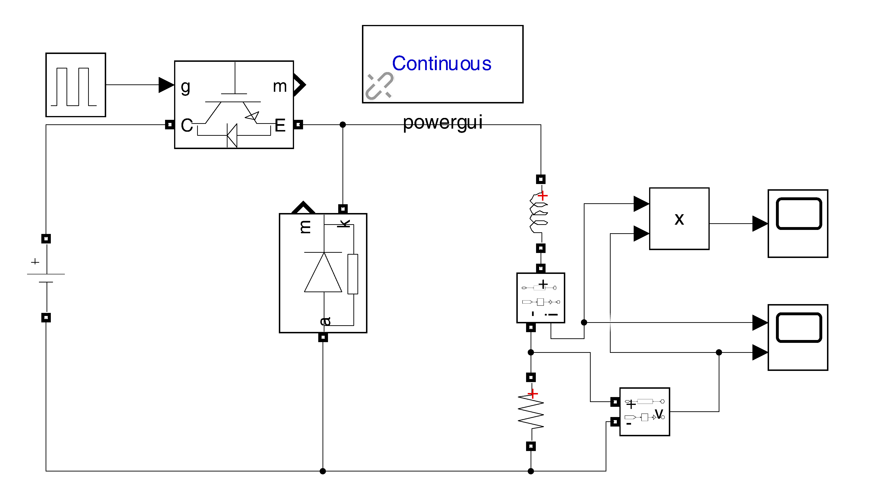
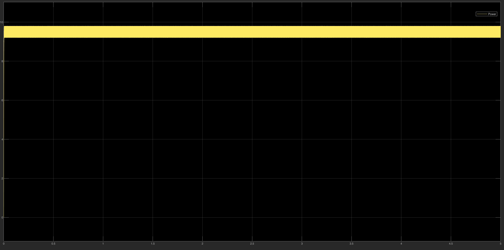
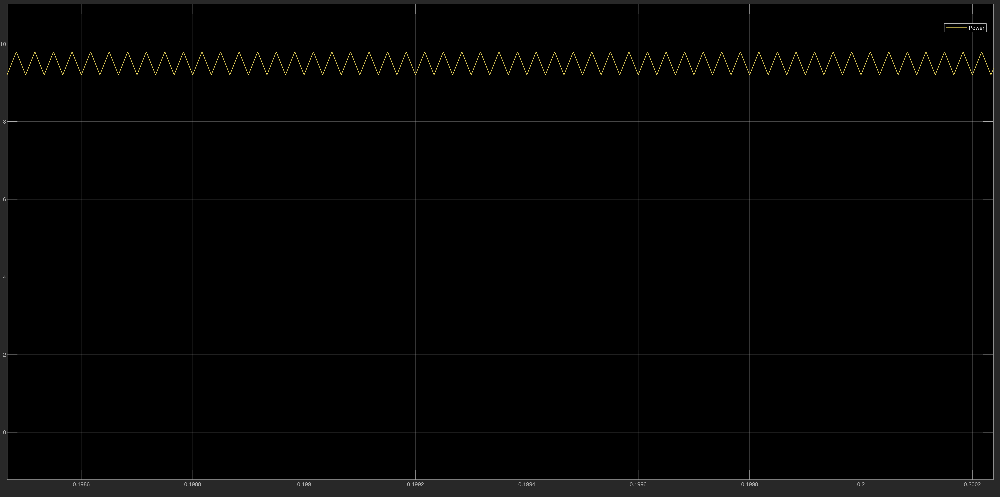

# 🚙 EV Load Management & Buck Charger

This folder contains the simulation models and control logic for the Electric Vehicle (EV) charging stage. This subsystem is responsible for safely stepping down the high-voltage DC Link (600V) to the appropriate levels required by the EV battery, ensuring optimal charging efficiency and strict adherence to battery safety limits.

## 📂 Engineering Progression & File Structure

Our design methodology for the EV charger follows a two-phase validation process:

### 1️⃣ Open-Loop Power Stage Validation

* **`Buck_Open_Loop.slx`**: The foundational open-loop model of the Buck converter. This simulation validates the baseline component sizing (inductor, capacitor, and switching devices) and the fundamental step-down switching logic before the introduction of feedback loops.

### 2️⃣ Closed-Loop CC-CV Charging (Integration Phase)

* *(Upcoming Integration)*: The comprehensive closed-loop models implementing the dual-loop control architecture, ensuring safe charging across varying States of Charge (SoC).

---

## ⚙️ Control Strategy: CC-CV Profile

To maximize battery lifespan and ensure safe energy transfer, the final control architecture is designed to strictly follow a **Constant Current - Constant Voltage (CC-CV)** charging profile:

1. **Constant Current (CC) Phase:** Activated when the battery is empty or at a low SoC. The PI controller tightly regulates the injected current to a safe maximum to prevent thermal damage, allowing the battery voltage to rise dynamically.
2. **Constant Voltage (CV) Phase:** Activated when the battery approaches its maximum capacity. The controller clamps the output voltage at a strict threshold to prevent chemical degradation and overvoltage, allowing the current to naturally decay to zero.

---

## 📊 Open-Loop Simulation Results

The initial open-loop testing demonstrates the converter's robust capability to step down the DC link voltage while maintaining stable output power under a resistive load.

**Buck Converter Open-Loop Architecture:**

**Voltage and Current Output Verification:**
The scopes below display the steady-state output voltage and current. The zoomed-in views specifically validate that the peak-to-peak switching ripples fall well within our target design margins (e.g., $\Delta I_L \le 20\%$).

**Output Power Stability:**

---

### 🔧 How to Run

1. Open MATLAB and navigate to this folder.
2. Open the `.slx` model to evaluate the power stage dynamics.
3. Click **Run** to execute the simulation and inspect the output ripples and steady-state values via the connected Scope blocks.
